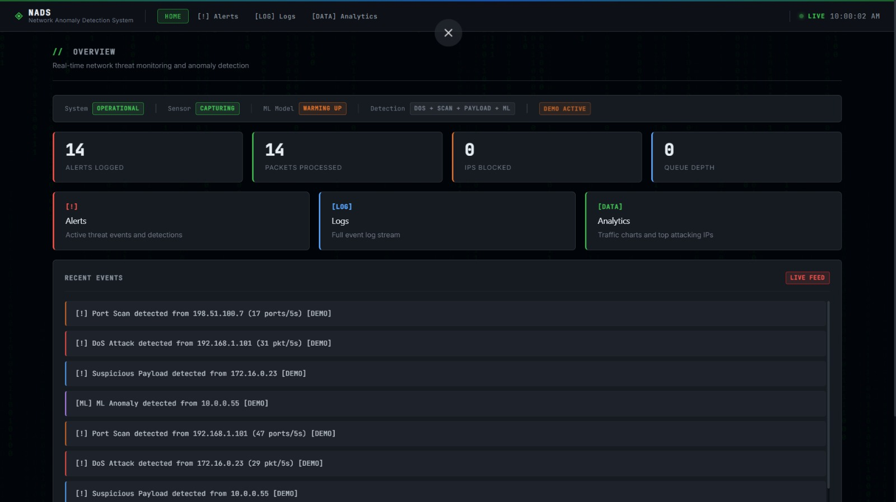
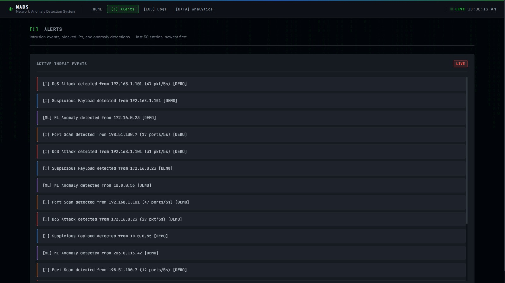
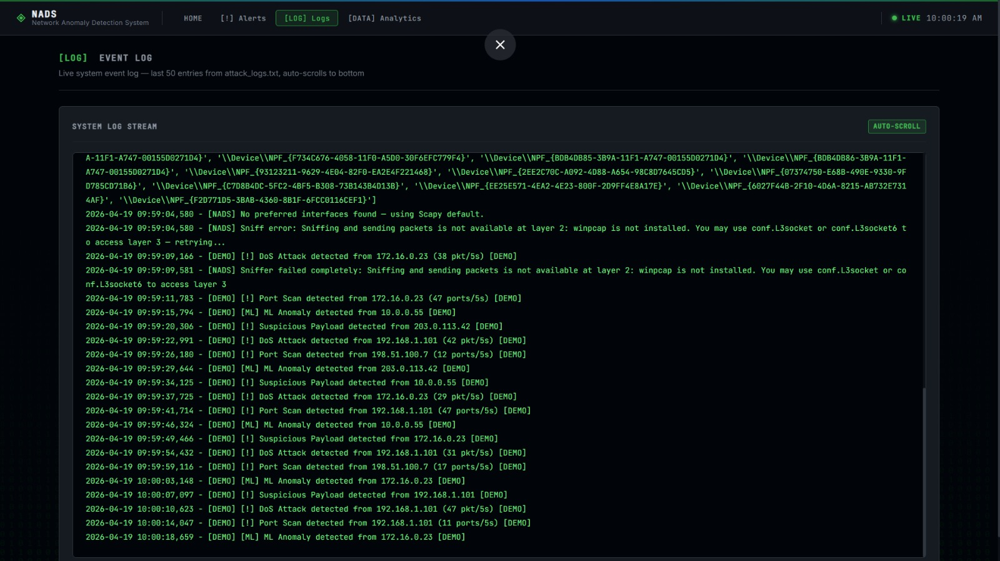
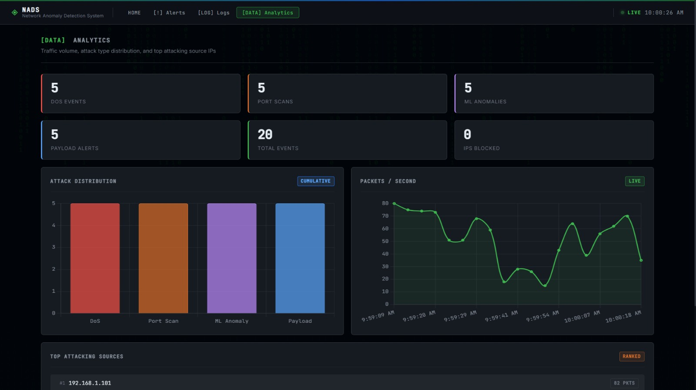

🛡️ NADS — Network Anomaly Detection System

A real-time Network Anomaly Detection System (NADS) built using Flask, Scapy, and Machine Learning to detect suspicious network activity such as DoS attacks, Port Scans, and Malicious Payloads.

This project provides a live web dashboard that visualizes alerts, traffic trends, and attack analytics.

🚀 Features

✅ Real-time packet monitoring
✅ Detection of:

DoS Attacks
Port Scanning
Suspicious Payloads
ML-based anomalies

✅ Live dashboard visualization
✅ Traffic analytics charts
✅ IP blocking capability
✅ Demo mode (synthetic attack simulation)
✅ Multi-threaded architecture
✅ Logging and alert history

🧠 Technologies Used
Python 3
Flask (Web Framework)
Scapy (Packet Sniffing)
NumPy
Scikit-learn (Isolation Forest ML Model)
HTML / CSS / JavaScript
WSL (Ubuntu)

📁 Project Structure

NADS/
│
├── app.py                 # Flask Web Application
├── sniffer.py             # Packet Sniffer + Detection Engine
├── attack_logs.txt        # Runtime logs
├── alerts.txt             # Alert history
│
├── templates/
│   ├── index.html
│   ├── alerts.html
│   ├── logs.html
│   └── analytics.html
│
├── static/
│   ├── css/
│   ├── js/
│   └── images/
│
├── venv/                  # Virtual environment
└── README.md

📊 Dashboard Modules

🏠 Home Dashboard

Displays:

Total alerts
Attack summary
Queue depth
ML training status
🚨 Alerts Page

Shows:

Real-time attack alerts
IP addresses detected
Attack types
📜 Logs Page

Displays:

Historical logs
Attack messages
System events
📈 Analytics Page

Charts:

Traffic patterns
Attack distribution
Top attacking IPs

## 📸 Screenshots

### 🏠 Dashboard

---

### 🚨 Alerts Page

---

### 📜 Logs Page

---

### 📈 Analytics Page

